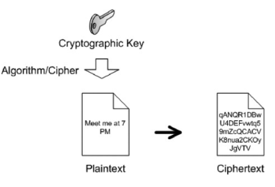

# Crypto Tool

A tool to play and learn basic concept of cryptography.

## 

```bash
npm install -g @vue/cli
git clone 
cd 
npm i 
npm run serve
```

## Features

- Basic concept of cryptography
- Hashing
- Symmetric Cryptography
- Asymmetric Cryptography
- Digital Signature

## What is Cryptography?

> Science of hiding thing (or text) in such a way that only intended person can see it

- Why you want to hide?
    - So that the hidden text can be stored at insecure place
    - So that the hidden text can be transmitted via insecure network/channel
    - So that only authorized person can view it
- The text which is to be hide, called PlainText
- The hidden text is called CipherText



## Encryption & Decryption

### Encryption

- Process in which original data is convert into random or meaningless
- Or, the process of hiding text

### Decryption

- Process in which encrypted data (or meaningless data) is convert back to original text.
- Or, the process of revealing original text.


## Symmetric Key Cryptography

- Encrypt and Decrypt data with the same key, secret key


## Asymmetric Key Cryptography

- Encrypt and Decrypt data using two different keys
    - Public Key: Used for encryption 
    - Private Key: Used for decryption


## Hashing


## Digital Signature


## Refrences and thing to read

- https://www.youtube.com/watch?v=8NgVGnX4KOw
- https://www.youtube.com/watch?v=bBC-nXj3Ng4
- https://blog.coincodecap.com/different-types-of-crypto-wallets/
- https://cryptobook.nakov.com/cryptographic-hash-functions


