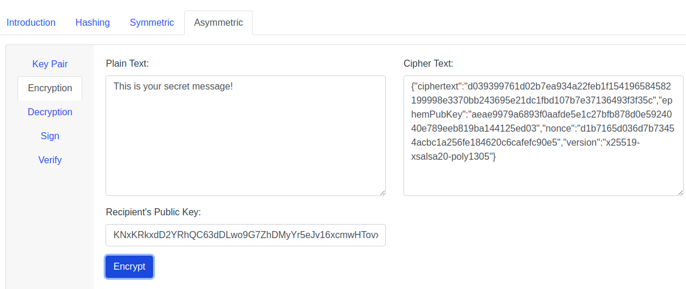

# Crypto Tool

A tool to play and learn basic concept of cryptography. Checkout the playgroung [here](https://vishwas1.github.io/crypto/index.html#/crypto)

## 

```bash
npm install -g @vue/cli
git clone 
cd 
npm i 
npm run serve
```

## Features

- [Basic concept of cryptography](docs/README.md)
    - Hashing
    - Symmetric Key Cryptography
    - Asymmetric Key Cryptography
    - Digital Signature

## Libraries

- Hashing
    - [Blakejs](https://www.npmjs.com/package/blakejs)
    - [SHA js](https://www.npmjs.com/package/sha.js)
- Symmetric Key Cryptography
    - [Aes-js](https://www.npmjs.com/package/aes-js) with CTR mode
- Asymmetric Key Cryptography
    - [TweetNacl](https://www.npmjs.com/package/tweetnacl)
    - [Ed2Curve](https://www.npmjs.com/package/ed2curve)

## Screens

### Hashing


### Symmetric Key Cryptography


### Asymmetric Key Cryptography

#### Generating Key Pair
 


#### Encryption



#### Decryption


#### Digital Signature

**Signing Message**


**Verifying Message**


